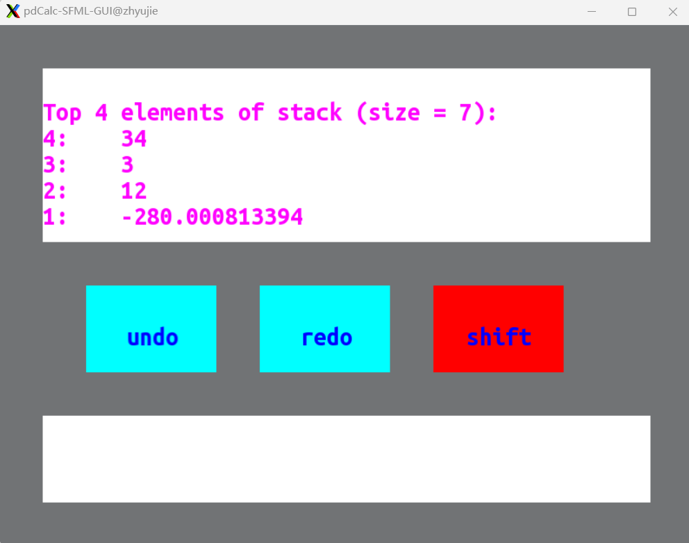

# pdCalc
pdCalc is an RPN(Reverse Polish Notation) calculator Implemented by *Practical C++ Design From Programming to Architecture by Adam B. Singer*, 
I try to use SFML to implement the GUI version.

I design a Button class to combine a sf::rectangleShape and a 
sf::Text  
Following Cli class from the book, I design a Gui class that inherits from UserInterface class, which 
can manage graphics components.

In the above picture, the shift Button will become red, if the Shift Key is pressed, which is used to input the -, +, * operators.